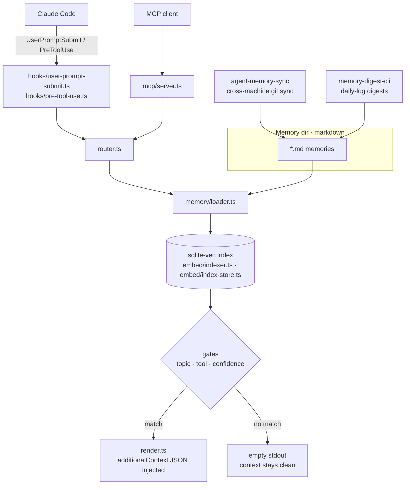

# agent-memory

**Persistence layer for AI agents.** Sync, weave, route, and digest agent memories across sessions, machines, and platforms so an agent picks up where it left off instead of starting from scratch every time.

> Most agent infrastructure assumes the model carries the context. It doesn't: the moment a session ends, the context window evaporates and the next run is a blank slate. agent-memory is the durable substrate underneath. Persist what you learned, sync it across machines, and let a routing layer decide which memories matter for the next prompt.

## How it works

`memory-router` turns every prompt into a gated lookup over your markdown memory dir: matches are injected as `additionalContext`, misses leave the context window untouched.



## Try it in 60 seconds

The flagship package is [`memory-router`](packages/memory-router): a deterministic memory-injection layer for Claude Code. Drive it once and the rest of the suite makes more sense.

```bash
git clone https://github.com/LanNguyenSi/agent-memory
cd agent-memory/packages/memory-router
npm install && npm run build

# Tiny scratch corpus so the demo doesn't touch your real memory dir.
mkdir -p /tmp/memory-router-demo
cat > /tmp/memory-router-demo/feedback_force_push.md <<'EOF'
---
name: No force-push to shared branches
description: Force-push on master/main overwrites history
type: feedback
topics: [destructive_ops]
severity: critical
---

NEVER force-push to master or main. The history is shared; rewriting
it costs every collaborator a hard reset and loses uncommitted work.
For local-branch fixes, prefer a fixup commit + interactive rebase
before push.
EOF

# Positive: prompt mentions force-push, the topic gate fires, the memory
# is injected.
echo '{"prompt":"can I git push --force to master to fix this?"}' \
  | MEMORY_ROUTER_DIR=/tmp/memory-router-demo \
    node dist/hooks/user-prompt-submit.js

# Negative: nothing matches, stdout stays empty (Claude's context stays clean).
echo '{"prompt":"rename foo to bar"}' \
  | MEMORY_ROUTER_DIR=/tmp/memory-router-demo \
    node dist/hooks/user-prompt-submit.js
```

## What a run looks like

The positive prompt prints one line of JSON on stdout:

```json
{"hookSpecificOutput":{"hookEventName":"UserPromptSubmit","additionalContext":"**memory-router** — 1 relevant memory applies:\n\n### No force-push to shared branches  _(topic · 1.00)_\nNEVER force-push to master or main. The history is shared; rewriting\nit costs every collaborator a hard reset and loses uncommitted work.\nFor local-branch fixes, prefer a fixup commit + interactive rebase\nbefore push."}}
```

Claude Code injects `additionalContext` as system context for the model on every prompt that matches. The negative prompt prints nothing and exits 0: when no gate fires, stdout stays empty so the context window stays clean. Read the [memory-router README](packages/memory-router) for the wiring (hook, MCP server, lint, stale-reference checker).

## Packages

| Package | Reach for it when |
|---------|-------------------|
| [memory-router](packages/memory-router) | You want Claude Code to actually apply your memory files instead of hoping the model notices them. Topic / tool / confidence gates, lint, stale-reference detector. |
| [agent-memory-sync](packages/agent-memory-sync) | You run agents on more than one machine and need their memory dirs to converge via a shared git repo. Push / pull / cron / offline queue. |
| [memory-digest-cli](packages/memory-digest-cli) | You write daily memory logs and want a curated summary instead of re-reading raw markdown. Generates digests from `YYYY-MM-DD.md` files. |

The packages compose: `agent-memory-sync` keeps memory files in step across machines, `memory-digest-cli` distills the raw daily logs into curated summaries, and `memory-router` decides which entries get injected per prompt.

## Repo layout

`agent-memory` is a folder of independent packages, not an npm workspaces / pnpm / lerna monorepo. There is no root `package.json`, no workspace manifest, and no shared root `node_modules`. Each package under `packages/` carries its own `package.json`, install, build, test, and version, so the install pattern is the same for any of them:

```bash
cd packages/<name> && npm install && npm run build
```

If you only care about one package, work in its directory; nothing at the root needs to be set up first.

## Status

Experimental. memory-router is the most production-shaped surface (hook contract, MCP server, lint, stale detector, schema-versioned sqlite index). The other packages cover working but earlier-stage workflows: see each package README for current capabilities.

## Contributing

See [CONTRIBUTING.md](CONTRIBUTING.md) and [CODE_OF_CONDUCT.md](CODE_OF_CONDUCT.md). Security issues: [SECURITY.md](SECURITY.md).
